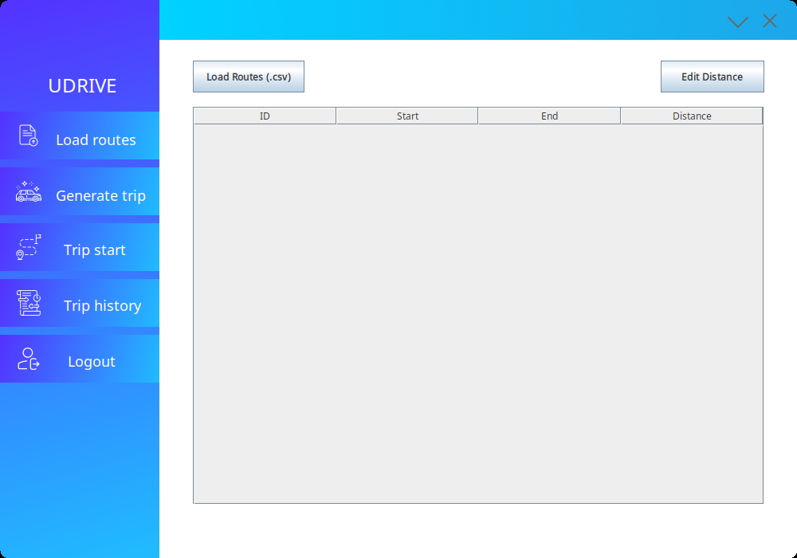

# Original UDrive design (2024)

This directory preserves the visual project from IPC1 Practice 2 as it existed
before the 2026 update. The `src/`, `nbproject/`, `build.xml`, and `manifest.mf`
files were recovered from commit `8f6fa6f`. In particular,
`src/main/MainFrame.form` and `src/main/Distance.form` retain the editable
NetBeans design, along with its Java classes, images, and animations.



The `pom.xml` in this directory was added later so the original version can be
built with dependencies available today. It does not modify the historical
source code or mix it with the completed application.

The original `nbproject/` configuration still contains references to old Windows
folders and a local JAR from the original setup. From the repository root,
use Maven to run this version:

```bash
./mvnw -f legacy/2024/pom.xml package
java -jar legacy/2024/target/UDrive-Original.jar
```

The completed application now uses the original interface in the repository's
top-level `src/` directory. Run it with `java -jar target/UDrive.jar` after
building it.

The original project was unfinished. This historical edition keeps that state
so you can see how it was designed and programmed at the time.
